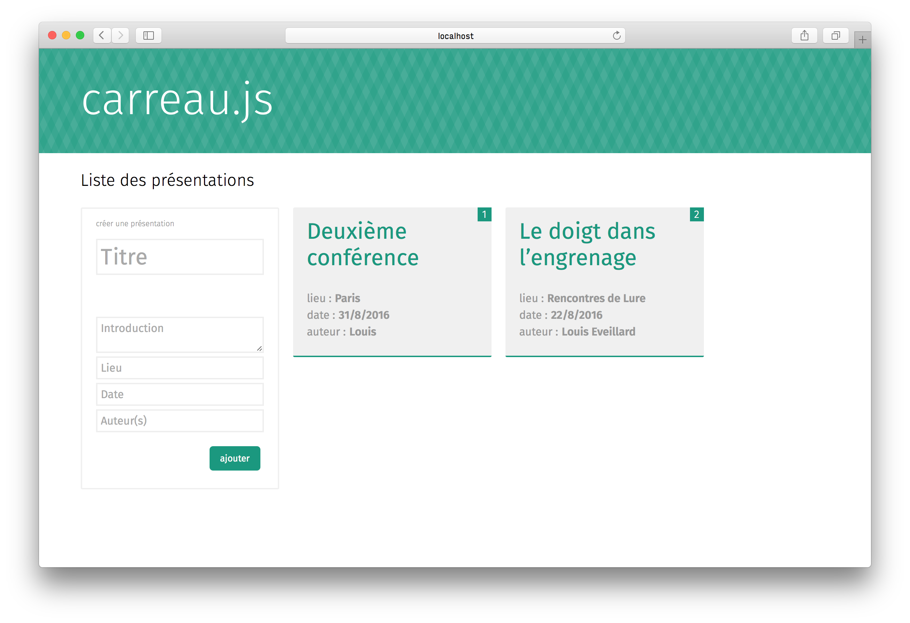

**todo**

A presentation is made from cards that form a stack.

## How it looks / how it works

--> demo of the app in a browser: https://www.youtube.com/watch?v=ANm2Vu5Gr58

## How to install

You need node.js and npm to install this preview of carreau.js

In a terminal : 

1. `git clone --recursive https://github.com/louis-ev/carreau.js path/to/the/folder`
2. `cd path/to/the/folder`
3. `npm install`

Now run carreau.js by writing

* `npm start`

## How to tweak, fork and debug

### server-side

* Run `npm run debug` to start the server with a better debug in terminal

### client-side

To tweak and write some new SASS or client-side JS, you need to run the gulp task:

* `gulp`

To add a library, go to the `client` folder and use bower commands (such as `bower install isotope --save`).
